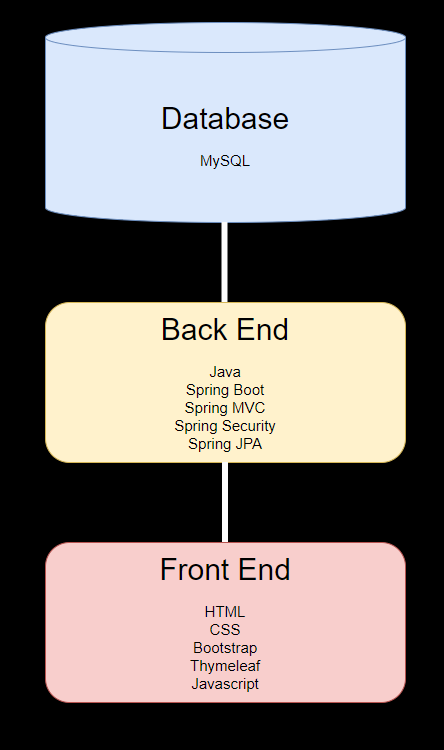

# Woof Walkers
## Overview
Woof Walkers is an application that gives dog owners the ability to schedule an appointment to have their dog walked whenever they need it.

- [Daily Progress](#Daily-Progress)
- [Total Progress](#Total-Progress)
- [User Stories](#User-Stories)
  - [User](#User)
  - [Admin](#Admin)
- [Wireframe](#Wireframe)
- [Technical Architecture](#Technical-Architecture)
- [Technical Challenges](#Technical-Challenges)
- [For the Future](#For-the-Future)

## Daily Progress
**April 25 (95%)**
* Added testing methods for repository and service

**To-Do**
* Add comments
* Create zip file and submit to canvas

*April 22 (90%)
* Added ability to assign multiple dogs to an appointment
* Removed background from html pages that display tables so that they are easier to view
* Updated Navbar navigation

April 21 (90%)
* Fixed CRUD for updating a user
* Fixed CRUD for deleting dog to avoid foreign key constraint

April 20 (82%)
* Custom queries working as expected

April 19 (82%)
* Added custom queries (not complete)

April 18 (75-80%)
  * Added navbar for in-app navigation
  * Added feature that when a user schedules a walk that appointment is registered to the current user
  * Added profile page that displays the user's dogs and scheduled appointments
  * Updated user stories
  * Updated wireframe
  * Updated security for which pages can be accessed by different roles
  * Added ability to grant admin and superadmin privileges.
  * Added additional fields to user registration.
  
April 15 (60% done)
* Added feature that when a user registers a dog, that dog is registered to the current user who is logged in

April 14 (55% done)
* Completed CRUD operations for Appointment
* All basic CRUD operations completed
* Started implementing user registration

April 13 (35% done)
* Updated CRUD operations for Appointment but unable to save date and time

April 12 (25-30% done)
* Added Dog model, DogRepository, DogService, and DogServiceImpl
* Implemented CRUD operations for Dog
* Created corresponding HTML pages for Dog CRUD
* Added Appointment model, AppointmentRepository, AppointmentService and AppointmentServiceImpl
* Implemented CRUD operations for Appointments
* Created corresponding HTML pages for Appointment CRUD
* All tables linked with foreign keys
* April 11 (20% done)

Today I changed my project from a social media app to a scheduling app that allows users to schedule an appointment to have their dog walked.

## Total Progress
* Case Study Rubric
https://docs.google.com/document/d/1g-WW5qg5hG9iibcexZXdJLNDt_5qBlPq/edit

## User Stories

### User
* As a user, I want to have a customized profile so that my profile is unique to me.
  * As a user, I want my profile to display my dog's information so that I can view my dog's information.
  * As a user, I want my profile to display the walks that I have scheduled so that I can keep track of my appointments.
* As a user, I want to schedule multiple appointments so that I can have my dog walked on different days.
* As a user, I want to register multiple dogs so that I don't have to create a new profile for each of my dogs.
* As a user, I want to schedule an appointment for multiple dogs so that I can have both of my dogs walked at the same time.

### Admin
* As an admin, I want to be able to control appointments so that I can adapt to various changes.
  * As an admin, I want to be able to update scheduled appointments so that if a user has a schedule conflict I can adapt.
  * As an admin, I want to be able to delete appointments so that if a user no longer needs an appointment I can remove it.
* As an admin, I want to update user information so that if a user's information changes I can adapt.
* As an admin, I want to delete user information so that users can be removed if needed.

## Wireframe
* https://www.figma.com/file/0aUQZvliXKJ65VpRpjj9mf/Woof-Walkers?node-id=0%3A1

## Technical Architecture

## Technical Challenges
* One of the technical challenges I had was 

## For the Future
* Add functionality to be able to have multiple dog walkers and allow users to choose their dog walker.
* Allow users to customize their profile with a picture of their dog(s)
* Automate scheduling so that appointment scheduling does not overlap.
* Sync appointments with a user's calendar
* Add Google Maps API and java logic to determine if the user is within a maximum distance of an available 'walker'